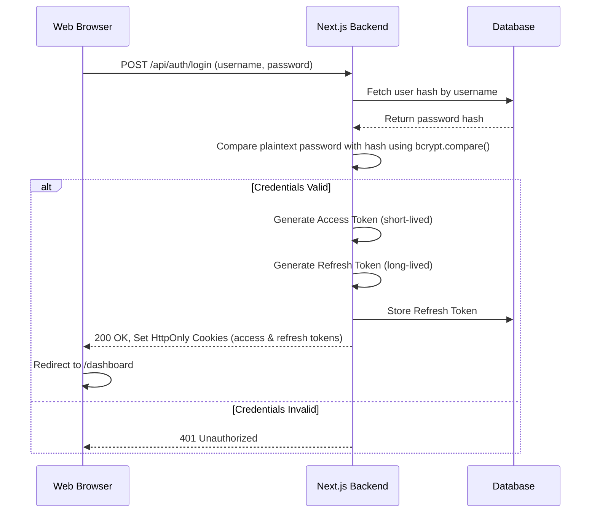
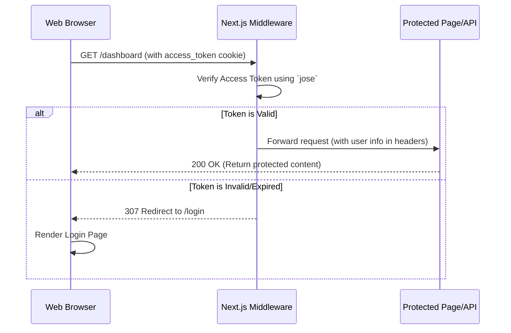

# System Design: Next.js JWT Authentication System
**Version:** 1.0
**Date:** June 10, 2025

## 1. Introduction

This document details the design of a secure, modern authentication system for a Next.js application. The primary goal is to protect web pages and API endpoints using JSON Web Tokens (JWT), ensuring a secure and seamless user experience. The system supports standard credentials-based login, role-based access control (RBAC), and an automatic, "seamless" token refresh mechanism to keep users logged in during extended sessions.

The architecture is designed to be secure, scalable, and maintainable, leveraging modern best practices for web authentication.

## 2. Core Concepts & Technology Stack

### 2.1. Technology Stack

* **Framework:** Next.js (with App Router)
* **JWT Library:** `jose` (Edge Runtime compatible)
* **Password Hashing:** `bcryptjs`
* **Cookie Handling:** `cookie`
* **Language:** TypeScript

### 2.2. Authentication Strategy

The system is built around a token-based authentication model using a pair of JWTs:

* **Access Token:** A short-lived JWT (e.g., 15 minutes) sent with every request to access protected resources. Its short lifespan minimizes the risk of damage if it is compromised.
* **Refresh Token:** A long-lived JWT (e.g., 7 days) used solely to obtain a new Access Token when the old one expires. It is stored securely and only sent to a specific refresh endpoint.

### 2.3. Token Storage

To mitigate Cross-Site Scripting (XSS) attacks, all tokens are stored in **`HttpOnly` cookies**. This prevents any client-side JavaScript from accessing the tokens, which is a major security vulnerability when using `localStorage`.

* `access_token`: Stored in a cookie with `Path=/`.
* `refresh_token`: Stored in a cookie with a more restrictive `Path=/api/auth/refresh` to ensure it is only sent when a new access token is being requested.

### 2.4. Edge-Compatible Middleware

Next.js Middleware (`middleware.ts`) is the cornerstone of this design. It runs on the **Edge Runtime**, providing a fast and efficient way to intercept all incoming requests before they reach the page or API route. The middleware is responsible for:
1.  Checking for the presence of an `access_token`.
2.  Verifying the token's validity using the `jose` library.
3.  Redirecting unauthenticated users to the login page.
4.  Enriching the request headers with user information (`X-User-Id`, `X-User-Role`) for authenticated users.

## 3. Authentication Flow

### 3.1. User Registration & Password Security

Passwords are never stored in plaintext. The `bcryptjs` library is used to hash and salt passwords before they are stored in the database.

1.  A user provides a plaintext password during registration.
2.  The server generates a random salt.
3.  `bcryptjs` hashes the password with the salt.
4.  The resulting hash is stored in the user's database record.

### 3.2. Login Flow

The login process authenticates the user and establishes a secure session by issuing tokens.



### 3.3. Protected Route Access

This flow demonstrates how the middleware protects resources.



### 3.4. Logout Flow

The logout process securely terminates the user's session by invalidating tokens on both the client and server.

1.  The client sends a `POST` request to `/api/auth/logout`.
2.  The server finds the `refresh_token` from the cookie.
3.  The server deletes the `refresh_token` from the database to prevent it from being used again.
4.  The server responds by sending back `Set-Cookie` headers that clear both the `access_token` and `refresh_token` cookies, effectively logging the user out on the client side.

## 4. API Design

| Endpoint                 | Method | Description                                                                   | Payload                    | Success Response                                      |
| ------------------------ | ------ | ----------------------------------------------------------------------------- | -------------------------- | ----------------------------------------------------- |
| `/api/auth/login`        | `POST` | Authenticates user and returns tokens as `HttpOnly` cookies.                    | `{ "username", "password" }` | `200 OK` with user info and `Set-Cookie` headers.     |
| `/api/auth/logout`       | `POST` | Logs the user out by clearing cookies and invalidating the refresh token.     | (None)                     | `200 OK` with expired `Set-Cookie` headers.         |
| `/api/auth/refresh`      | `POST` | (Future enhancement) Issues a new access token using a valid refresh token.   | (None, uses cookie)        | `200 OK` with a new `access_token` in `Set-Cookie`.   |
| `/api/data`              | `GET`  | An example protected API route that returns data only to authenticated users. | (None, uses cookie)        | `200 OK` with protected JSON data.                    |

## 5. Project Structure

The project is organized to separate concerns, making it easy to navigate and maintain.

```
next-jwt-auth-app/
├── app/
│   ├── (auth)/                 # Public routes (e.g., login)
│   │   └── login/
│   │       └── page.tsx
│   ├── (protected)/            # Routes protected by middleware
│   │   ├── dashboard/
│   │   │   └── page.tsx
│   │   └── layout.tsx
│   └── api/
│       ├── auth/
│       │   ├── login/route.ts
│       │   └── logout/route.ts
│       └── data/
│           └── route.ts        # Protected API route
├── lib/
│   ├── auth.ts                 # Core JWT logic using 'jose'
│   ├── definitions.ts          # TypeScript type definitions
│   ├── db.ts                   # Mock database for demonstration
│   └── password.ts             # Password hashing with 'bcryptjs'
├── middleware.ts               # Authentication middleware
├── .env.local                  # Environment variables (JWT secrets)
└── package.json
```

## 6. Security Considerations

* **XSS Prevention:** `HttpOnly` cookies are used to prevent client-side script access to tokens.
* **CSRF Protection:** The `SameSite=Strict` attribute on cookies provides strong protection against Cross-Site Request Forgery attacks.
* **Password Security:** Strong, one-way, salted hashing (`bcryptjs`) is used for all user passwords.
* **Token Security:** Using short-lived access tokens minimizes the window of opportunity for attackers if a token is compromised. Refresh token invalidation on the server side provides a mechanism to revoke sessions.
* **Environment Variables:** All secrets are stored in `.env.local` and are not exposed to the client-side bundle.

## 7. API Testing

API endpoints can be tested using tools like `cURL`.

**1. Failure Case (No Token)**
```bash
curl -i http://localhost:3000/api/data
# Expect: 307 Temporary Redirect to /login
```

**2. Success Case (Login and Access)**
```bash
# Step 1: Login and save the cookies to a file
curl -i -X POST -H "Content-Type: application/json" \
-d '{"username": "user", "password": "user123"}' \
-c cookies.txt http://localhost:3000/api/auth/login

# Step 2: Use the saved cookies to access the protected route
curl -b cookies.txt http://localhost:3000/api/data
# Expect: 200 OK with JSON payload
```